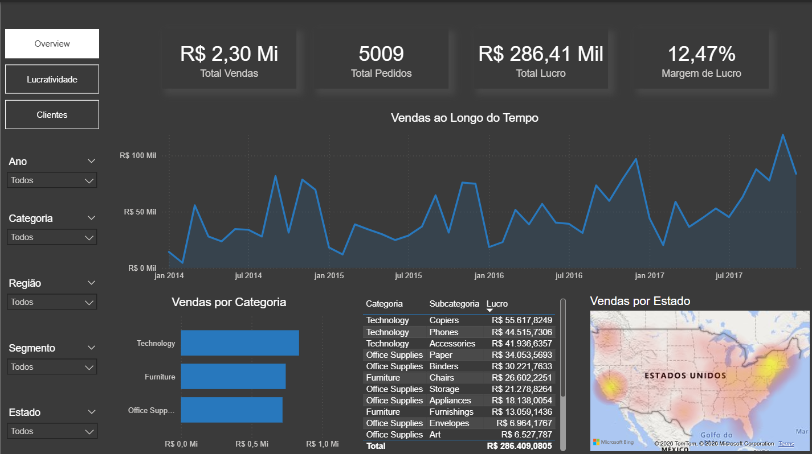
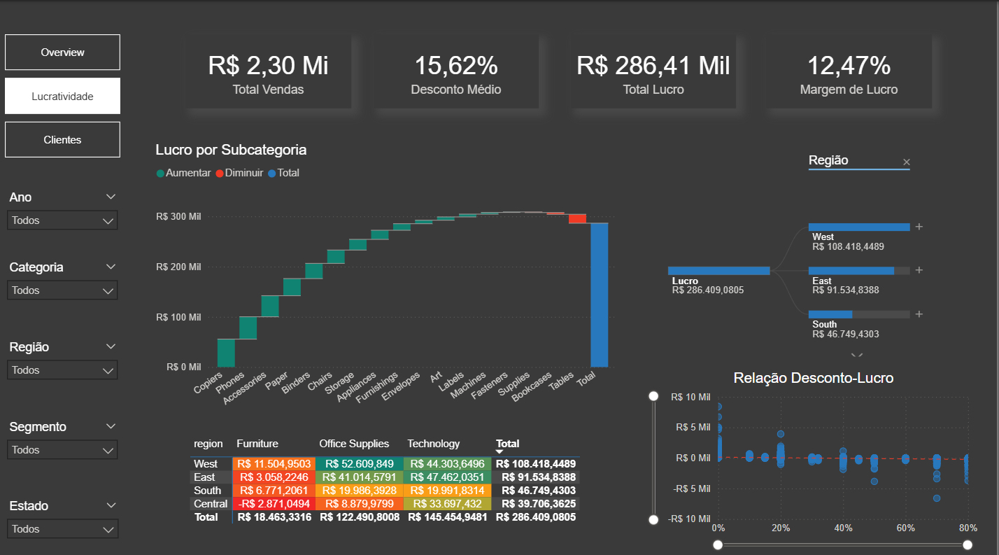
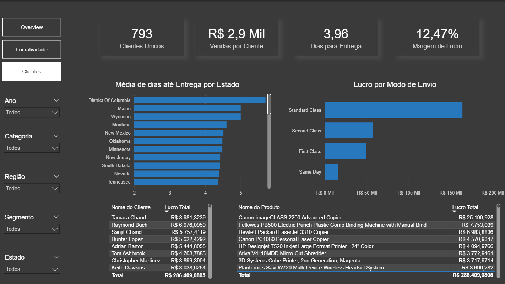

# Superstore sales - Análise de Dados
Projeto de Análise de Dados com Python (VS Code) e Power BI, utilizando o dataset Superstore Sales (kaggle).

O Desenvolvimento do projeto consiste em simular uma situação real, a partir do entendimento limpeza e tratamento dos dados. Posteriormente, a visualização e evidenciação do que os dados representam, são representados através de dashboards interativos no Power BI.

## Contexto
O dataset em questão simula operações de uma rede varejista norte-americana fictícia entre o período de 2014 a 2017. Dessa forma, cabe ao júnior tratar e limpar os dados, bem como identificar e gerar insights que possam agregar valor a empresa.

## Ferramentas
- Python (VS Code) - importação, limpeza e tratamento dos dados;
- Power BI Desktop - visualizações e Dashboards interativos.

## Estrutura das pastas
- 'data/raw/' - dataset original do kaggle
- 'data/intermin/' - dataset intermediário, tratado o encoding para UTF-8 para realizar as operações
- 'data/processed/' - dataset final, com as informações tratadas e limpas
- 'notebook/' - notebook no qual o tratamento foi realizado (Jupyter Notebook)
- 'powerbi/' - arquivo .pbip com os dashboards

## Dashboards
- **Página 1** - Visão Geral das Vendas ao Longo do Tempo, Espaço, suas Categorias e Subcategorias

- **Página 2** - Detalhamento da Lucratividade, abordando relações de Descontos, Regiões, Categorias, Cubcategorias, Cegmento de Cliente e Margem de Lucro

- **Página 3** - Detalhamento de Clientes e Operações, abordando clientes mais lucrativos, produtos mais vendidos e envios mais solicitados.

## Insights e Tomada de Decisão
Com a realização de todo o fluxo de tratamento e visualização de dados, foi possível identificar alguns pontos importantes, tais como:

- **Sazonalidade**: Pico de receita no 4° Trimestre, com grandes aumentos em Setembro e principalmente, Novembro e Dezembro, logo após uma leve queda no mês de Outubro.
    - **Ação**: Garantir planejamento de estoque para abastecer o aumento de final de ano.

- **Regionalização**: Oeste e Leste dos Estados Unidos dominam com maiores receitas, apesar do Sul aumentando nos últimos períodos.
    - **Ação**: Oportunidade de expansão para áreas 'inexploradas' e fidelização de clientes das grandes regiões já consolidadas.

- **Technology**: Technology apresenta maior Lucratividade, mesmo com o menor volume de pedidos entre as três categorias. Muito pode ser atrelado aos altos descontos aplicados para os clientes
    - **Ação**: Possibildade de aumento de volume de pedidos, com campanhas de vendas de produtos premium, bundles e afins.

- **Descontos**: Foi observado que, altos descontos destroem a margem de lucro. Valores entre 30-40% não geram margem de lucro e, acima de 40% a margem acumulada é majoritariamente nula ou negativa, mesmo com vendas em alto volume.
    - **Ação**: Redução dos descontos acima de 40% para garantir maior margem. O ponto ideal seria até 20% de desconto, onde a margem de lucro ainda se mantém predominantemente positiva.

- **Segmentação de Clientes**: Segmento Corporativo tem o valor médio por pedido mais alto, mesmo que em menor volume.
    - **Ação**: Sugestão de adoção de estratégias de vendas B2B diferenciadas. Desconto progressivo por volume comprado (respeitando os limites impostos e sinalizados no tópico 'Descontos').